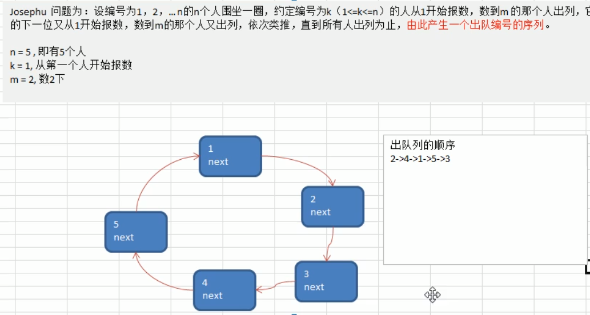
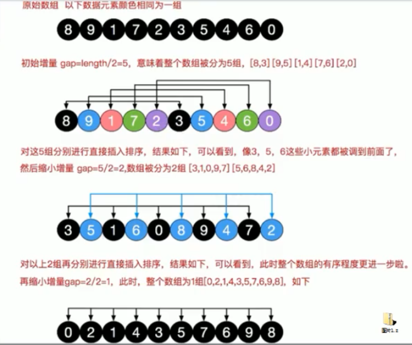

# 数据结构

## 2019-06-25
## 总括
  数据结构主要包括线性结构和非线性结构

## 线性结构
- 线性结构的特点是数据元素之间存在一对一的线性关系
- 线性结构有两种不同的存储结构：即顺序存储结构（数组）和链式存储结构（链表）。顺序存储的线性代表为顺序表，顺序表中的存储元素是连续的（内存地址是连续的）
- 链式存储的线性代表是链表，链表中的存储元素不一定是连续的，元素中存放数据元素及相邻元素的地址信息
- 线性结构常见的有：数组、队列、链表和栈

## 非线性结构
- 非线性结构包括：二位数组，多维数组，广义表，树结构，图结构

## 稀疏数组
#### 需求
- 当有一个五子棋棋盘，需要进行存盘和读取上盘记录时，可以使用稀疏数组
- 当有大量的且相同的默认值，可以只保存不同的数据即可
#### 概述
- 当一个数组中大部分元素为0，或者为同一个值的数组时，可以使用稀疏数组来保存该数组（当记录很多没有意义的数据时使用稀疏数组）

#### 处理方法
- 将稀疏数组的第一行用来记录原始数组一共有几行、几列、有几个不同的值
- 从第二行开始，每行记录原始数组的第几行第几列是哪个值，记录每个不同值的位置

#### 问题：将存储的稀疏数组保存到本地，需要恢复时再将本地文件读取出来并恢复成二维数组？？？
#### 代码参考@SparseArray.java类


## 队列
#### 概述
- 队列是一个有序列表，可以用数组或者链表来实现
- 遵循先入先出的原则

#### 数组模拟队列
- 队列本身是有序列表，若使用数组来存储队列数据，则maxSize为该队列的最大容量
- 需要使用front和rear分别标识队列前后端的下标
- 当添加队列时 rear+1 ，当出队时 front+1 当front == rear时 队列为空
- 当rear == maxSize - 1 时队列满，不可再添加

##### 问题分析并优化
- 目前数组使用一次就不能用了，没有达到复用的效果
- 将这个数组使用算法，该进程一个环形的队列  取模%

#### 数组模拟环形队列
- 将数组看做一个环形的（通过取模的方式来实现）
- 分析思路：
    - front变量的含义做一个调整：front就指向队列的第一个元素，也就是说arr[front]是队列的第一个元素
    - rear变量的含义做一个调整：rear指向队列的最后一个元素的最后一个位置，也因为希望空出一个元素作为约定
    - 当队列满时，条件是 (rear + 1) % maxSize == front
    - 当队列为空时，rear == front
    - front和rear的初始值 = 0
    -  当我们这样分析，队列中有效的数据的个数： (rear + maxSize - front) % maxSize


## 链表
#### 概述
- 链表是以节点的方式来存储的，是链式存储。
- 每个节点包含data域，next域：指向下一个节点。
- 链表的各个节点**不一定是连续存储的**。
- 链表分为带有头结点和没有头结点的链表，根据实际需求来确定。

#### 单向链表实现
##### 练习
- 使用带head头的单向链表实现-->> 水浒英雄排行榜管理
    - 完成对英雄人物的增删改查操作
    - 不考虑排名，直接插入到链表中
    - 按照排名插入到指定位置（如果有这个排名，则添加失败，给出提示信息）

- 考虑排名时的单向链表实现
    - 首先找到新添加的节点的位置，通过辅助变量（指针），通过遍历来找到
    - 新的节点.next = 原来的temp.next
    - 再将temp.next = 新的节点

- 修改节点信息，根据no来修改，no不能改变（改变相当于添加）
    - 先找到要修改的节点
    - temp.name = newHeroNode.name;  temp.nickName = newHeroNode.nickName;

- 删除节点
    - 需要找到待删除节点的前一个节点temp
    - 删除时只需要将temp.next = temp.next.next
    - 被删除的节点将不会有其他指向指引，被GC回收


#### 单链表面试题
##### 求单链表中有节点的个数
@see SingleLinkedListDemo#getLength方法

##### 查找单链表中的倒数第k个节点【新浪面试题】
@see SingleLinkedListDemo#findIndexNode方法

##### 单链表的反转【腾讯面试题，有点难度】
@see SingleLinkedListDemo#reverseList方法

##### 从尾到头打印单链表【百度，要求方式1：反向遍历。方式2：stack栈】
@see SingleLinkedListDemo#reversePrint方法

##### 合并两个有序的单链表，合并之后的链表依然有序【课后练习】


#### 双向链表
##### 概述
- 管理单向链表的缺点分析：
    - 单向链表，查找的方向是能是一个方向，而双向链表可以向前或者向后查找。
    - 单向链表不能自我删除，需要靠辅助接点，而双向链表可以自我删除，所以我们前面单链表删除节点时总是找到temp（temp是待删除节点的前一个节点）

- 分析双向链表的遍历，添加，修改，删除的思路：
    - 遍历：和单链表一样，只是可以向前，也可以向后查找
    - 添加（默认添加到双向链表的最后）
        - 先找到双向链表的最后这个节点
        - temp.next = newHeroNode
        - newHeroNode.pre = temp;
    - 修改思路和原理同单向链表一样
    - 删除
        - 因为是双向链表，因此可以实现自我删除某个节点
        - 直接找到要删除的这个节点，比如temp
        - temp.pre.next = temp.next
        - temp.next.pre = temp.pre

#### 单向环形链表
##### 约瑟夫问题
```
Josephus问题为：设编号为1,2,3，……，n的n个人围坐一圈，约定编号为k(1 <= k <= n)的人从1开始报数，数到m的那个人出列，他的下一位又从1开始报数，
数到m的那个人又出列，以此类推，知道所有人出列为止，由此产生一个出列编号的序列。
```


##### 构建一个单向环形链表的思路
```
根据用户的输入，生成一个小孩出圈的顺序
n = 5, 有5个人
k = 1, 从第1个人开始报数
m = 2, 数2下
```
- 构建一个单向的环形链表思路
    - 先创建第一个节点，让first指向该节点，并形成环形
    - 后面我们每创建一个新的节点时，就把该节点加入到已有的环形链表中即可
- 遍历环形链表
    - 先让一个辅助指针，指向first节点
    - 然后通过一个while循环遍历该环形链表即可  当curr.next == first 结束

##### 报数出圈
- 思路
    - 创建一个辅助指针 helper，事先应该指向环形链表的最后这个节点
    - 小孩报数前，需要先让first和helper移动k - 1次(从第k个小孩开始报数，若k = 1时，则不需要移动)
    - 当小孩报数时，让first和helper指针同时移动 m - 1 次
    - 这是就可以将节点出圈
        - first = first.next
        - helper.next = first
        - 原来的first指向的节点没有引用就会被回收

#### 代码实现
@see Josephus


## 栈
#### 栈的介绍
- stack
- 栈是一个先入后出（FILO-First In Last Out）的有序列表
- stack是限制线性表中元素的插入和删除只能在线性表的同一端进行的一种特殊线性表。允许插入和删除的一端，为变化的一端，称为栈顶（Top），另一端
    为固定的一端，称为栈底（Bottom）
- 根据栈的定义可知，最先放入栈中的元素在栈底，最后放入的元素在栈顶，而删除元素则相反，最后放入的元素最先删除，最先放入的元素最后删除
- 入栈push，出栈pop
#### 栈的应用场景
- 子程序的调用
- 处理递归调用
- 表达式的转换（中缀表达式转后缀表达式）与求值
- 二叉树的遍历
- 图形的深度优先(depth-first)搜索法 

#### 数组模拟栈的思路分析
- 实现栈的思路分析
    - 使用数组来模拟栈
    - 定义一个top来表示栈顶，初始为-1
    - 入栈操作，当有数据加入到栈时，top++ ； stack[top] = data;
    - 出栈操作，int value = stack[top]; top-- , return value

#### 练习 使用单链表实现栈的模拟


#### 使用栈完成计算一个表达式的结果
- 思路分析
    - 通过一个index值来遍历我们的表达式
    - 如果我们发现是一个数字就直接入栈
    - 如果发现扫描的是一个符号，就分如下情况
        - 如果发现当前的符号栈为空，就直接入栈
        - 如果符号栈有操作符，就进行比较
        - 如果当前的操作符的优先级小于或者等于栈中的操作符，就需要从数栈中pop出两个数，再从符号栈中pop出一个符号，进行运算，将得到的结果入
            数栈，然后将当前的操作符入符号栈
        - 如果当前的操作符的优先级大于符号栈中的操作符，就直接入符号栈
    - 当表达式扫描完毕，就顺序的从数栈和符号栈中pop出相应的数和符号，进行运算
    - 最后在数栈中只有一个数字，就是表达式的结果

#### 代码实现
@see Calculator


#### 前缀、中缀、后缀表达式（逆波兰表达式）
##### 前缀表达式（波兰表达式）
- 前缀表达式的运算符位于操作数之前
- 举例说明 (3+4)x5-6 对应的前缀表达式就是 - x + 3 4 5 6
- 计算机计算时是从右至左进行扫描，先将数字压入栈内，遇到符号时弹出栈顶和次顶元素进行运算，将运算结果再压入栈内
##### 中缀表达式
- 中缀表达式就是最常见的运算表达式
- 中缀表达式人最熟悉，但是计算机并不熟悉，不好运算
##### 后缀表达式
- 后缀表达式与前缀表达式相似，只是运算符位于操作数之后
- 例如： (3+4)x5-6   --->>>   3 4 + 5 x 6 -
- 计算机处理时是从左到右扫描


##### 逆波兰计算器
- 输入一个逆波兰表达式，使用栈计算其结果
- 支持小括号和多位数整数
- 思路分析
- 代码完成
##### 代码
@see PolandNotation

### 5.5 中缀表达式转换为后缀表达式
- 思路分析：
    - 例：1 + ( ( 2 + 3 )  x 4 ) - 5 = 
    - 1.初始化2个栈，运算符栈s1和存储中间结果的栈s2；
    - 2.从左至右扫描中缀表达式；
    - 3.遇到操作数时，将其压入s2；
    - 4.遇到运算符时，比较其与s1栈顶运算符的优先级：
        - 4.1如果s1为空，或栈顶运算符为左括号 " ( "，则直接将此运算符入栈；
        - 4.2否则，若优先级比栈顶运算符的高，也将运算符压入s1；
        - 4.3否则，将s1栈顶的运算符弹出并压入到s2中，再次转到（4.1）与s1中新的栈顶运算符相比较；
    - 5.遇到括号时：
        - 5.1如果是左括号 " ( "，则直接压入s1；
        - 5.2如果是右括号 " ( "，则依次弹出s1栈顶的运算符，并压入s2，知道遇到左括号为止，此时将这一对括号丢弃；
    - 重复步骤2至5，知道表达式最后边；
    - 将s1中剩余的运算符依次弹出并压入s2；
    - 依次弹出s2中的元素并输出，结果的逆序即为中缀表达式对应的后缀表达式。

#### 5.5.1 代码实现
@see Covert2PolandNotation 有bug，未完成

## 6 递归

### 6.1 递归的应用场景：迷宫问题，八皇后问题
### 6.2 递归的概念
- 递归就是方法自己调用自己，每次调用传入不同的变量，递归有助于编程者解决复杂的问题，同时可以让代码变得简洁
### 6.3 递归调用机制：
- 打印问题
- 阶乘问题
- 使用示意图的方式
    - 当程序执行到一个方法时，就会开辟一个独立的空间（栈）
    - 每个空间的数据（局部变量），是独立的
### 6.4 递归能解决什么样的问题
- 各种数据问题：8皇后、汉诺塔、阶乘问题、迷宫问题....
- 各种算法：快排、归并排序、二分查找、分治算法等
- 将用栈解决问题，递归代码比较简洁

### 6.5 递归需要遵守的重要规则
- 执行一个方法时，就创建一个新的受保护的独立空间（栈空间）
- 方法的局部变量是独立的，不会相互影响，比如n变量
- 方法中使用的是引用类型变量（比如数组），就会共享该引用类型的数据
- 递归必须向退出递归的条件逼近，否则就是无限递归，出现StackOverflowError。死循环
- 当一个方法执行完毕，或者遇到return，就会返回，遵守谁调用就将结果返回给谁，同是当方法执行完毕或者返回时，该方法也就执行完毕

### 6.6 迷宫问题
##### 6.6.1 迷宫问题代码实现
@see MiGong

##### 6.6.2 迷宫问题的讨论
   1.小球得到的路径和设置的找路策略有关
   2.在得到小球路径时，可以先试用（下右上左），再改成（上右下左），看看路径是不是有变化
   3.测试回溯现象
   4.思考：如何求出最短路径

### 6.7 八皇后问题
##### 6.7.1 思路分析
- 第一个皇后先放到第一行第一列
- 第二个皇后放到第二行第一列、然后判断是否OK，如果不OK则继续放在第二列、第三列、依次把所有列都放完，找到合适的地方
- 继续第三个皇后，还是第一列、第二列......直到第八个皇后也能放在一个不冲突的位置，算是找到一个正确的解法
- 当得到一个正解时，在栈回退到上一个栈时，就会开始回溯，即将第一个皇后，放到第一列的所有正解全部得到
- 然后回头继续第一个皇后放第二列，后面继续循环执行1,2,3,4的步骤

``
说明：理论上应该创建一个二维数组来表示棋盘，但是实际上可以通过算法用一个一位数组即可解决问题。arr[8] = {0,4,7,5,2,6,1,3}。
对应arr下标表示第几行，arr[i] = val，val表示第i+1个皇后，放在第i+1行的第val+1列。
``

##### 6.7.2代码实现
@see Queue8

## 7 排序算法

### 7.1 排序算法的介绍
   排序也成排序算法，排序是将一组数据，按照指定的顺序进行排序的过程。
### 7.2 排序的分类
- 内部排序：将需要处理的所有数据都加载到内部存储器（内存）中进行排序
- 外部排序：数据量过大时，无法全部加载到内存中，需要借助外部存储（文件等）进行排序
- 常见的排序算法分类：
    - 插入排序：
        - 直接插入排序
        - 希尔排序
    - 选择排序：
        - 简单选择排序
        - 堆排序
    - 交换排序：
        - 冒泡排序
        - 快速排序
    - 归并排序
    - 基数排序

### 7.3 算法的时间复杂度
#### 7.3.1 度量一个程序（算法）执行时间的两种方法
- 事后统计法（需要在同样机器配置、同样环境下执行，计算时间）
- 事前估算法（时间复杂度）
#### 7.3.2 时间频度
`一个算法花费的时间与算法中语句的执行次数成正比，哪个算法中语句执行次数多，它花费的时间就多。一个算法中语句执行次数被称为语句频度或时间频度。记为T(n)`
- T(n) = 3n² + 7n + 6 
    - 常数项可以忽略  6
    - 低次项可以忽略  7n
    - 系数可以忽略  3
#### 7.3.3 时间复杂度
- 一般情况下，算法中的基本操作语句的重复执行次数是问题规模n的某个函数，用T(n)表示，若有某个辅助函数f(n)，使得当n趋近于无穷大时，T(n)/f(n)的极限值为不等于零的常数，
    则称f(n)是T(n)的同量级函数。记作T(n)= O(f(n))为算法的渐进时间复杂度，简称时间复杂度。
- T(n)不同，但时间复杂度可能相同。如：T(n)= n² + 7n + 6 与 T(n)= 3n² + 2n + 2它们的T(n)不同，但时间复杂度相同，都为O(n²)。
##### 7.3.3.1 常见的时间复杂度
- 常见的时间复杂度
  - 常数阶O(1)
  - 对数阶O(log₂n)
  - 线性阶O(n)
  - 线性对数阶O(nlog₂n)
  - 平方阶O(n²)
  - 立方阶O(n³)
  - k次方阶O(nk)
  - 指数阶(2ⁿ)

##### 7.3.3.2 平均复杂度和最坏时间复杂度
- 平均时间复杂度是指所有可能得输入实例均以等概率出现的情况下，该算法的运行时间。
- 最坏情况下的时间复杂度称最坏时间复杂度。一般讨论的时间复杂度均是最坏情况下的时间复杂度。
- 平均时间复杂度和最坏时间复杂度是否一致，和算法有关
### 7.4 算法的空间复杂度
- 一个算法的空间复杂度(Space Complexity)定义为该算法所耗费的存储空间，它也是问题规模n的函数。
- 空间复杂度是对一个算法在运行过程中临时占用存储空间大小的度量。有的算法需要占用的临时工作单元数与解决问题的规模n有关，它随着n的增大而增大，
    当n较大时，将占用较多的存储单元，例如快速排序和归并排序算法就属于这种情况。
- 在做算法分析时，主要讨论的就是时间复杂度。从用户使用体验上看，更看重的程序执行的速度。一些缓存产品其本质就是使用空间换时间。

### 7.5 冒泡排序
#### 7.5.1 基本介绍
``
冒泡排序（Bubble Sorting）的基本思想就是：通过对待排序序列从前向后（从下标较小的元素开始），依次比较相邻元素的值，若发现
逆序则交换，使值较大的元素逐渐从前移向后部，就像水底下的气泡一样逐渐向上冒。因为排序的过程中，各元素不断接近自己的位置，
如果一趟比较下来没有进行过交换，就说明序列有序，因此要在排序过程中设置一个标志flag判断元素是否进行过交换。从而减少不必要的比较（优化）
``
- 小结：
  - 一共进行(数组大小 - 1)次的大循环
  - 每一趟排序的次数在逐渐的减小
  - 如果发现在某趟排序中，没有发生过交换，可以提前结束排序

#### 7.5.2 代码实现
@see BubbleSort

### 7.6 选择排序
#### 7.6.1 基本介绍
 选择排序也属于内部排序法，是从欲排序的数据中，按指定的规则选出某一元素，再依规定交换位置后达到排序的目的。
 排序思路参考《我的第一本算法书》中选择排序的图解
   
#### 7.6.2 代码实现
@see SelectorSort

### 7.7 插入排序
#### 7.7.1 基本介绍
插入排序属于内部排序法，是对于欲排序的元素以插入的方式找寻该元素适当的位置，以达到排序的目的。
#### 7.7.2 插入排序思想
把n个待排序元素看成一个有序表和一个无序表，开始时有序表只有一个元素，无序表有n-1个元素。排序时每次从无序表中取出一个元素与
有序表进行比较，将其插入到适当位置，使之成为一个新的有序表。
#### 7.7.3 代码实现
@see InsertSort


### 7.8 希尔排序
#### 7.8.1 简单插入排序存在的问题
当数组arr = {2,3,4,5,6,1} 这时需要插入的最小数为1，其他数的后移次数明显增多，对效率有影响

#### 7.8.2 希尔排序法介绍
希尔排序也是一种插入排序，它是简单插入排序经过改进之后的一个更高效的版本，也成为缩小增量排序


#### 7.8.3 基本思想
希尔排序是把记录按下标的一定增量分组，对每组使用直接插入排序算法排序；随着增量逐渐减少，每组包含的关键词越来越多，
当增量减至1时，整个文件恰被分成一组，算法便终止。


#### 7.8.4 代码实现
   1.采用交换法
   2.采用移动法

```java
public class ShellSort{
	public static void main(Stringp[] args) {
		int[] arr = {8,9,1,7,2,3,5,4,6,0};
	}
	
	// 采用交换法  逐步推导
	public static void shellSortByStep(int[] arr) {
		// 第一轮时，是将10个数据分成5组  10/2 = 5
		for(int i = 5; i < arr.length; i++){
			// 遍历各组中的所有元素（共有5组，每组有2个元素），步长5
			for(int j = i - 5; j >= 0; j -= 5) {
				if(arr[j] > arr[j + 5]){
					int temp = arr[j];
					arr[j] = arr[j + 5];
					arr[j + 5] = temp;
				}
			}
		}
		System.out.println("第1轮排序后 = " + Arrays.toString(arr))
		
		// 第二轮时，是将是个数据分成了2组  5/2 = 2
		for(int i = 2; i < arr.length; i++){
			// 共有2组，每组有5个元素，步长2
			// i = 8时，j = 6  组内元素为0,2,4,6,8，每个都需要对比交换
			for(int j = i - 2; j >= 0; j -= 2) {
				if(arr[j] > arr[j + 2]){
					int temp = arr[j];
					arr[j] = arr[j + 2];
					arr[j + 2] = temp;
				}
			}
		}
		System.out.println("第2轮排序后 = " + Arrays.toString(arr))
		
		// 第三轮时，是将是个数据分成了1组  2/2 = 1
		for(int i = 1; i < arr.length; i++){
			for(int j = i - 1; j >= 0; j -= 1) {
				if(arr[j] > arr[j + 1]){
					int temp = arr[j];
					arr[j] = arr[j + 1];
					arr[j + 1] = temp;
				}
			}
		}
		System.out.println("第3轮排序后 = " + Arrays.toString(arr))
	}
	
	// 采用交换法
	public static void shellSort(int[] arr) {
		// 根据逐步推导，收集规律一次到位
		for(int gap = arr.length / 2; i > 0; i /= 2){
			for(int i = gap; i < arr.length; i++){
				for(int j = i - gap; j >= 0; j -= gap) {
					if(arr[j] > arr[j + gap]){
						int temp = arr[j];
						arr[j] = arr[j + gap];
						arr[j + gap] = temp;
					}
				}
			}
		}
		
	}
	
	// 采用移动法
	public static void shellSort1(int[] arr) {
		
	}
}
```


root
    |- - - admin
        |- - - DWD
        |- - - DWS
        |- - - BDS
            |- - - default
            |- - - queue1
            |- - - queue2
        |- - - ADS
            |- - - default
            |- - - queue1
                |- - - default
                |- - - sub_q1
                |- - - sub_q2
            |- - - queue2
        |- - - ASY
            |- - - default
            |- - - queue1
            |- - - queue2
        |- - - 数据服务
            |- - - default
            |- - - queue1
            |- - - queue2
    |- - - default